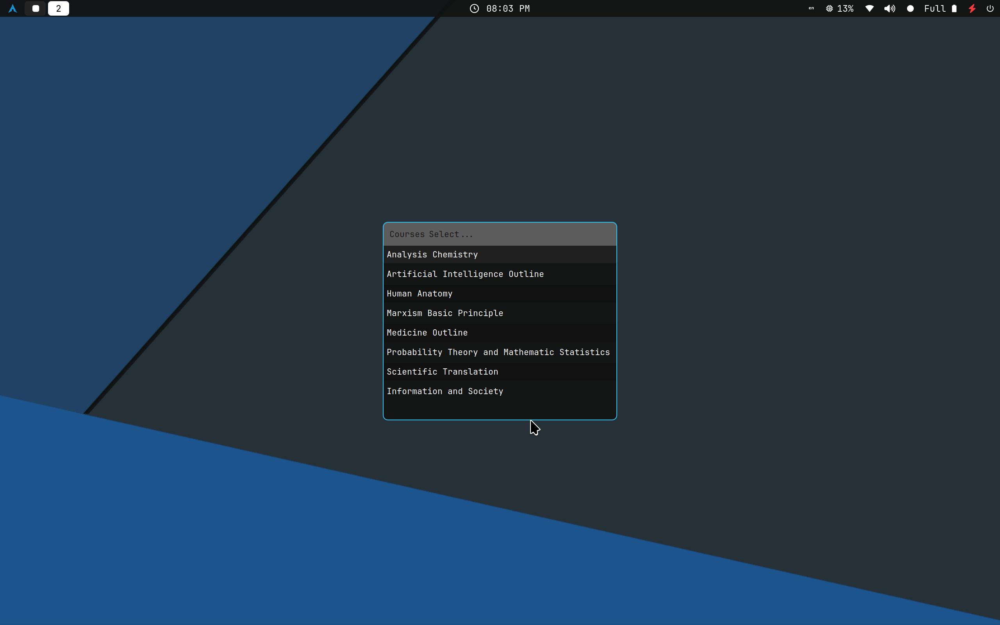
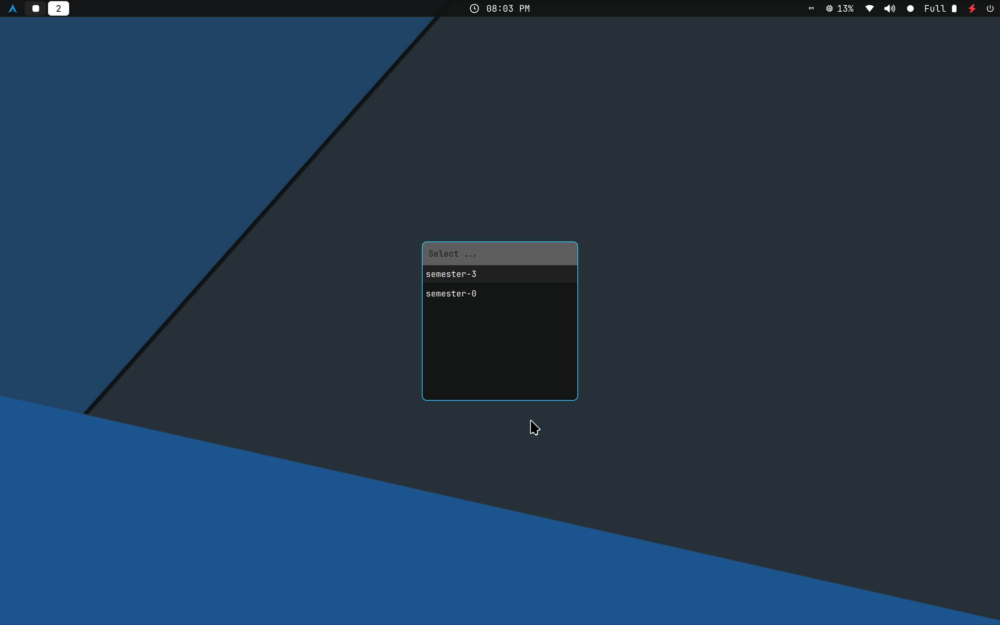
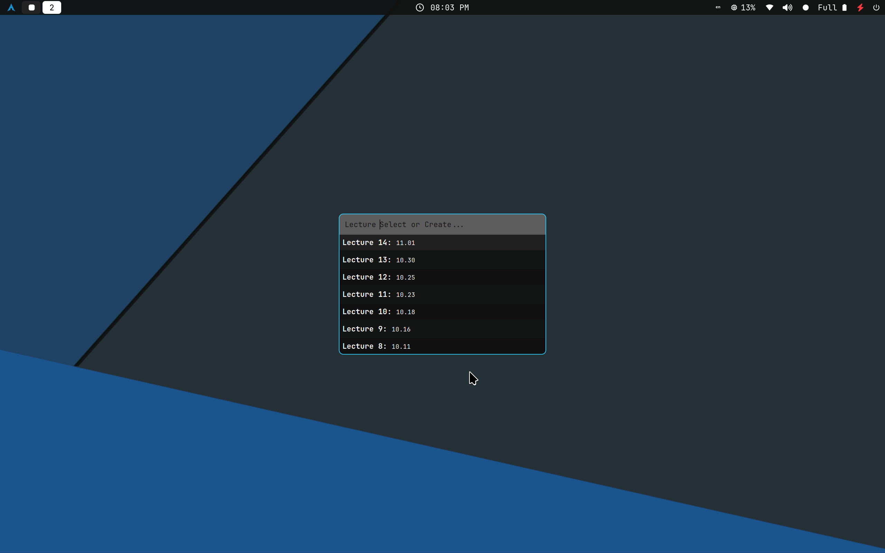
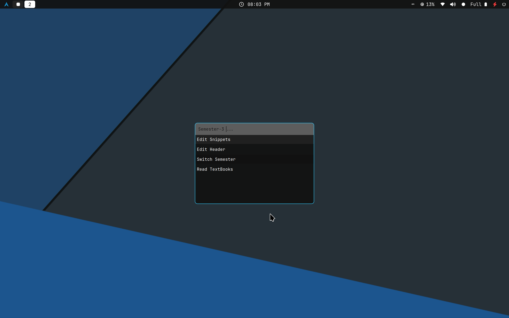
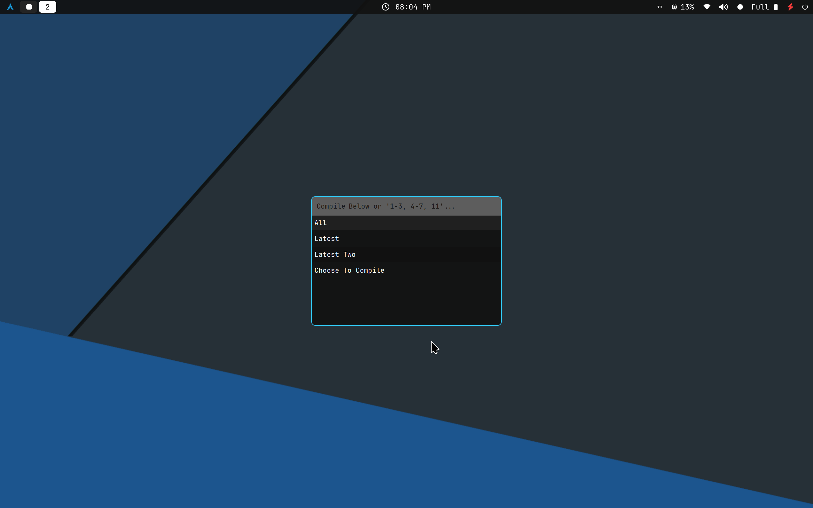

# NoteMan: My Latex Note Manager
This project is inspired by [Gilles Castel's Notebook Manager](https://github.com/gillescastel/university-setup.git)

> This project is not fully compatible to Castel's file structure, check `lib/default.py` and change variables in it.
## Notebook struct
```text
Notebook
├── current-lecture -> /path/to/Notebook/semester-0/course-1
├── current-semester -> /path/to/Notebook/semester-0
├── semester-0
│   ├── Analysis Chemistry
│   │   ├── 1.tex
│   │   ├── 2.tex
│   │   ├── ...
│   │   ├── main.tex
│   │   ├── main.pdf
│   │   └── figures
│   │       ├── fig1.svg
│   │       ├── fig1.pdf
│   │       ├── fig1.pdf_tex
│   │       └── ...
│   ├── Probability Theory and Mathematical Statistics
│   │   ├── ...
│   │   └── figures
│   ├── ...
│   └── TextBooks -> ../TextBooks/semester-0
├── semester-1
│   ├── ...
│   └── TextBooks -> ../TextBooks/semester-1
├── TextBooks
│   └── semester-0
│       ├── course-1
│       ├── course-2
│       └── ...
└── UltiSnips
    ├── snippet-1.snippets
    ├── snippet-2.snippets
    └── ...
```
Check out my notebook detailed structure in [colledge-note](https://github.com/MCXCC303/college-note.git).

## Key Bindings
Check your window manager wiki and add bindings to execute rofi_XXX.py

## Previews
- Selections:



- Options:


- Compile:


